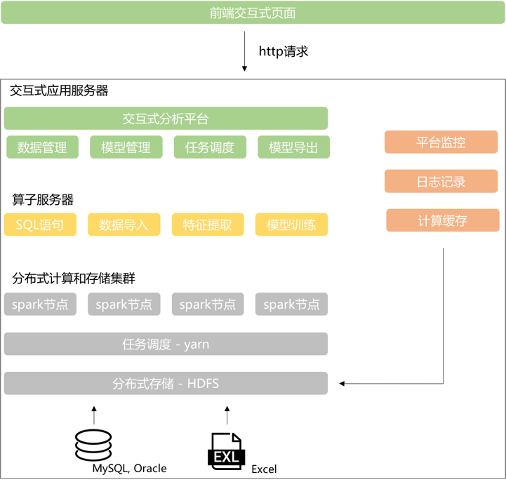
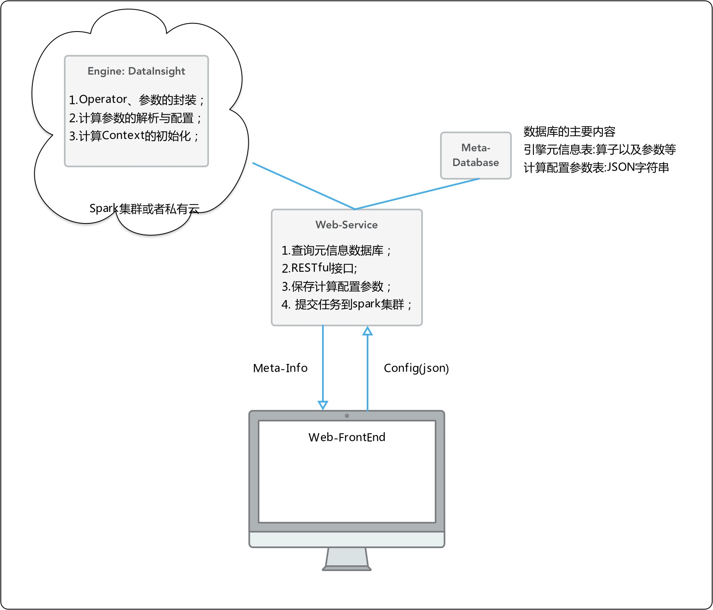
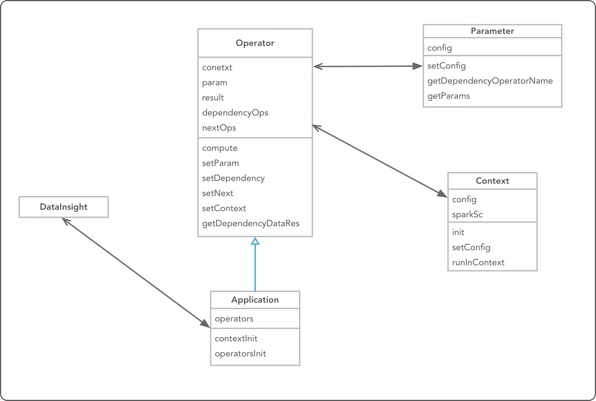

# 机器学习平台设计文档

## 背景

随着大数据的发展,在公安和航空等领域累积越来越多的数据，如何应用机器学习技术快速的挖掘数据背后的规律成为最紧迫的需求；特别是天津模型工厂的开发过程中，
我们对公安的业务和数据有了更多的了解，同时客户可希望应用机器学习和数据挖掘的技术来分析他们的数据，以及可配置的分析工具提供给他们使用。因此需要开发
机器学习平台来应对快速变化的分析业务，主要是为了解决以下问题：

1. 提高分析型业务的代码复用和业务；
2. 提供机器学习和数据挖掘的基础框架；
3. 降低机器学习和数据挖掘的门槛；
4. 为能力赋能平台提供基础平台支撑；
5. 提高项目的开发速度，降低项目开发成本；

机器学习既可以作为内部数据分析和机器学习的基础性平台，也可以提供给客户自由定制业务应用，同时也可以为基础性赋能平台提供给外部使用；

机器学习平台之于数据分析，就好比图易之于数据可视化，能够让实施人员快速的进行项目的实施与部署；打造数据分析与数据可视化整体服务的能力，进而打通从分析
到可视化的整个服务链路。

## 架构设计
机器学习平台主要是用hadoop做分布式数据存储，spark做分布式计算引擎；

### 平台子系统
机器学习平台主要由3个子系统构成：

1. 计算引擎(Engine)：封装Operator来做数据处理、挖掘和分析，以此来提供强大、灵活的数据处理和分析的能力；
2. Web前端配置系统(Web-FrontEnd)：前端配置界面从后端服务上取得各种元信息(比如算子、参数和数据源配置信息等)，以及提交算子和应用的配置参数并保存到数据库中；
3. Web服务系统 (Web-Service)：Web服务有两个主要功能：
	* 响应前端配置界面的请求，从数据库中获取元信息并发送给前端，将前端提交的配置信息保存到数据库中；
	* 启动计算引擎中的计算任务，提交到计算集群上进行运算，保存日志和错误信息等，以及计算任务的分配和调度等功能；

机器学习平台各子系统之间的交互关系：

## 计算引擎
计算引擎的核心组件有以下几个方面：

1. Operator(算子)类，负责整个平台的计算的抽象和封装，也就是在实际业务或者数据挖掘、分析过程中最小计算单元；
2. Application(应用)类，该类继承自Operator类，是对多个算子组合的运算逻辑，主要分为两类：
	* Normal Application，纯粹的只是算子组合的集合，表示算子的执行依赖以及先后关系；
	* Root Application，除了具备Normal Application的功能外，还会为每个Root-App分配对应的执行环境，比如SparkSession；
3. Context(执行环境)类，是对Spark的执行环境的封装，提供部分平台相关的方法和属性，每个Operator都有所属的Root-App的运行环境；
4. Parameter(参数)类，每个Operator都对应有一个参数属性，主要是控制算子的执行逻辑等，提供更加灵活的框架；

## 使用流程

1. 通过机器学习平台配置界面来配置算子形成业务应用；
2. 对于配置得到的业务应用，业务客户(比如)通过业务配置的前端界面就能够非常容易、灵活的配置各种业务相关的参数，从而实现客户想要定制化分析的需求；
3. 对于前端可视化应用，能够非常容易的接入和监听后端业务应用的出的数据结果，在前端界面上做可视化展示；
